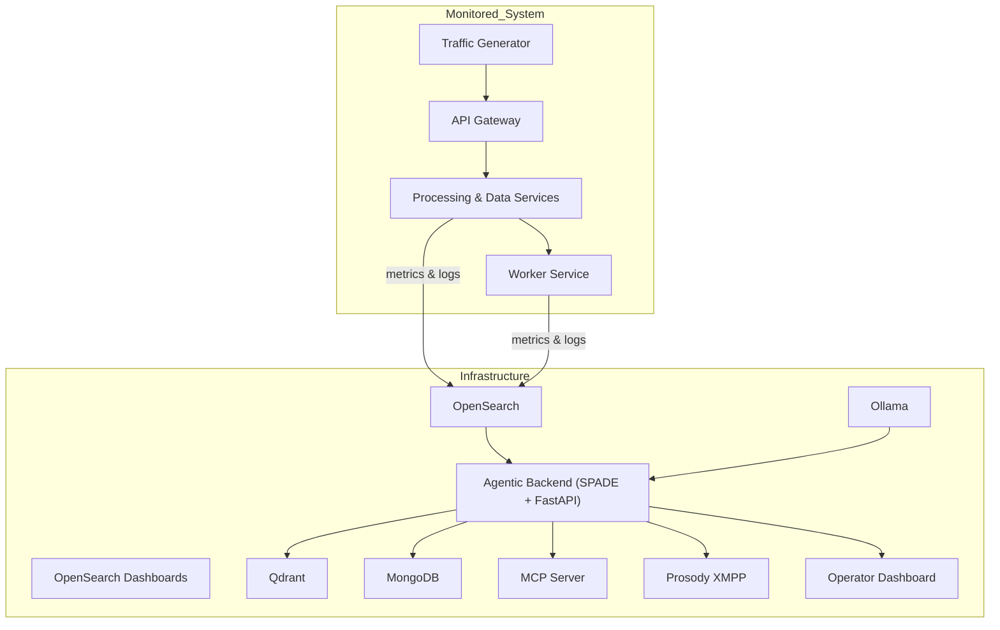
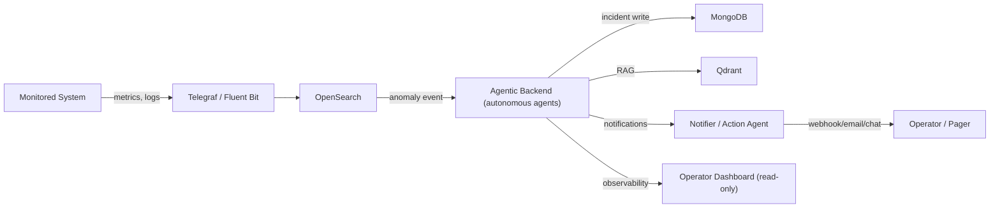

# AgenticProactiveMonitor

**Hybrid Multi-Agent System for Infrastructure Monitoring and Anomaly Detection**

AgenticProactiveMonitor is a hybrid multi-agent system for proactive infrastructure monitoring and anomaly detection. It combines autonomous agents, containerized orchestration, and observability tooling to detect incidents early, correlate signals, and support remediation workflows.

---

## Quick overview

- Continuous monitoring of infrastructure resources and services.
- Early anomaly detection through single-entity detectors and multi-signal correlation.
- Coordination of agents with distinct roles: collection, analysis, decision-making, and notification / remediation.
- Goal: reduce MTTD and MTTR through automation and operational guidance.

---

## Architecture overview

The repository includes diagrams that illustrate the component topology and telemetry flow.

Component overview (Mermaid):



Telemetry and incident management flow:



Note: Ollama runs natively on the Windows host and is used as the local LLM.

---

## Agent roles

1. **Collector Agent**  
   Collects metrics from hosts/services (CPU, RAM, disk), health endpoints, and logs.

2. **Analyzer Agent**  
   Applies rules, thresholds, and models to identify deviations and anomalous signals.

3. **Decision Agent**  
   Correlates events, scores severity, and defines suggested or automated actions.

4. **Notifier / Action Agent**  
   Sends alerts (webhook/email/chat) and can trigger remediation (container restart, escalation, ticket creation).

---

## Technology stack

Based on the repository composition:

- Python: ~76.6% (backend and agent logic)
- CSS / JS / HTML: UI and dashboard
- PowerShell / Shell: orchestration and bootstrap scripts
- Docker: container packaging and runtime execution

---

## Suggested repository structure

```text
.
├─ src/
│  ├─ agentic_backend/         # SPADE + FastAPI backend
│  ├─ agentic_dashboard/       # Flask operator dashboard (SPA)
│  ├─ infrastructure/          # docker-compose, bootstrap, Ollama scripts
│  ├─ monitored_system/        # sample services / traffic generator
│  └─ agents/                  # agent code and configuration
├─ scripts/                    # utility scripts (start/stop/status/logs)
├─ .env.example
└─ README.md
```

Adjust the names and paths to match the actual repository structure if they differ.

---

## Prerequisites

- Docker and Docker Compose
- Bash (Linux/macOS) or PowerShell/WSL on Windows
- Ollama installed and running on the host, if used as the local model
- Environment variables and secrets configured in `.env`

---

## Quickstart (local)

1. Clone the repository:

```bash
git clone https://github.com/davidedimarco00/AgenticProactiveMonitor.git
cd AgenticProactiveMonitor
```

2. Configure the environment:

```bash
cp .env.example .env
# edit .env: MongoDB password, XMPP credentials, Ollama endpoint if needed
```

3. Start the infrastructure services:

```bash
cd src/infrastructure
docker compose up --build -d
```

4. Start the monitored system:

```bash
cd src/monitored_system
docker compose up -d --build
```

5. Open the main endpoints:

- OpenSearch: http://127.0.0.1:9200
- OpenSearch Dashboards: http://127.0.0.1:5601
- FastAPI Swagger: http://127.0.0.1:8082/docs
- Operator Dashboard: http://127.0.0.1:5050

Useful commands:

```bash
# logs
docker compose logs -f agentic-backend
docker compose logs -f agentic-system-dashboard

# status
docker compose ps
```

---

## Anomaly detection concepts

Possible detectors and logic:

- Static thresholds (CPU, memory, error rate)
- Shift detection versus baseline (rate / derivative)
- Multi-signal correlation (metrics + logs + process state)
- Scoring and escalation policy (severity → remediation / operator action)

---

## Notifications and remediation

Configurable actions:

- Webhook / Chat (XMPP / Slack / MS Teams)
- Email
- Service / container restart
- Automatic ticket creation (integration with external systems)
- Escalation based on severity and time of day

---

## Security and best practices

- Do not commit secrets (`.env`, tokens). Use secret managers.
- Restrict permissions for remediation scripts.
- Log and audit automatic actions for post-mortem analysis.
- Separate environments (dev/test/prod) and validate remediations in controlled environments.

---

## Roadmap

- [ ] Real-time dashboard with incident visualizations
- [ ] Adaptive anomaly detection model (online learning)
- [ ] Cross-host event correlation and multi-entity detectors
- [ ] Plugin system to add new agents
- [ ] End-to-end tests and chaos testing
- [ ] Automated CI pipeline tests

---

## Contributing

1. Fork the repository
2. Create a feature branch: `git checkout -b feature/name`
3. Implement and test your changes
4. Commit: `git commit -m "feat: description"`
5. Push and open a Pull Request

For larger contributions, open an issue first to discuss design and impact.

---

## License

Specify the project license (e.g. MIT, Apache-2.0). If it is not already present, add a `LICENSE` file.

---

## Author

**Davide Di Marco**  
GitHub: [@davidedimarco00](https://github.com/davidedimarco00)

---

## Final notes

- Mermaid diagrams are rendered on GitHub; for local preview you can use VS Code Mermaid extensions or CLI tools.
- If you want me to update the secondary READMEs as well (`src/infrastructure/README.md`, `src/agentic_dashboard/README.md`) to keep terminology and diagrams consistent, I can prepare those changes too.
