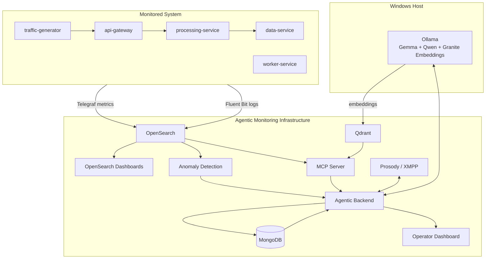
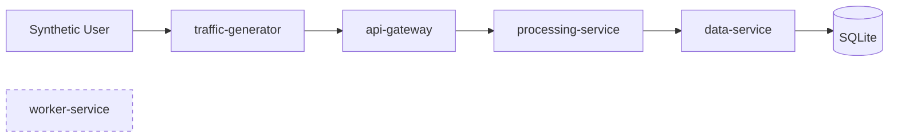
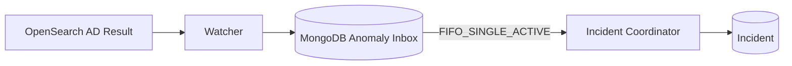
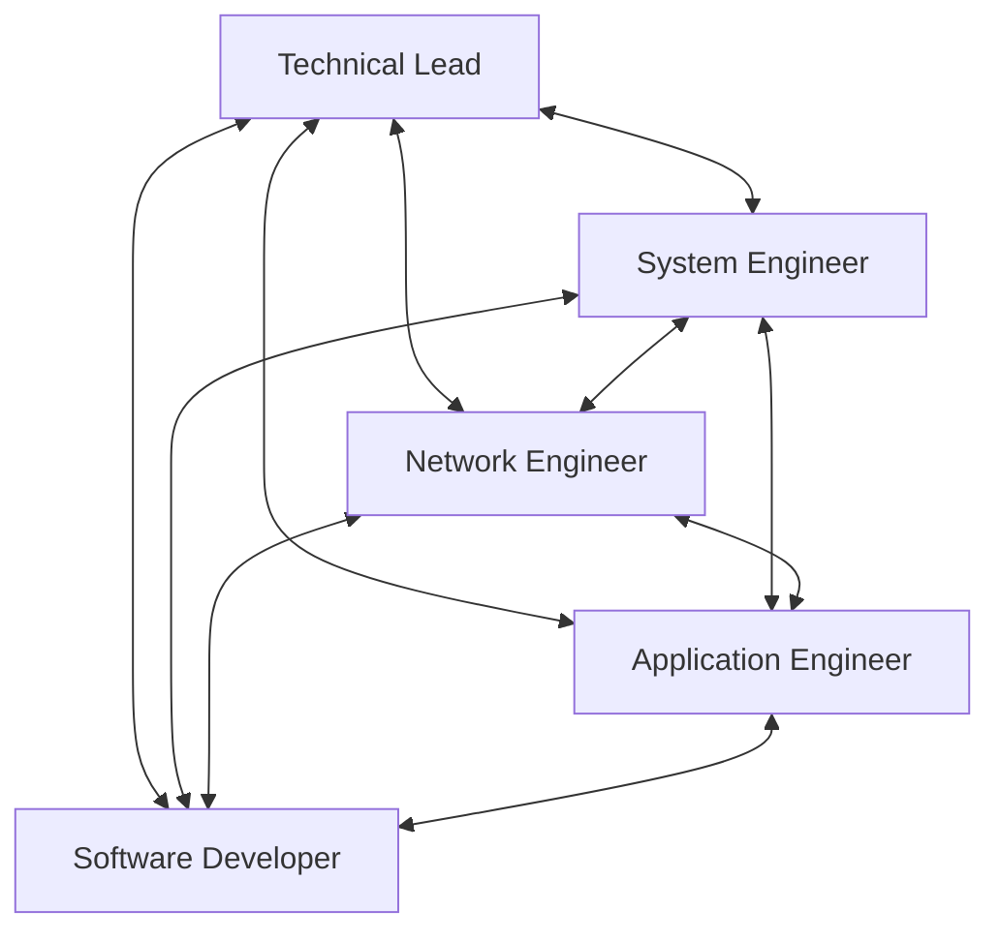
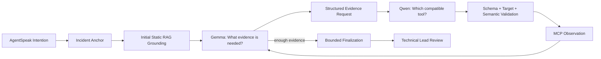
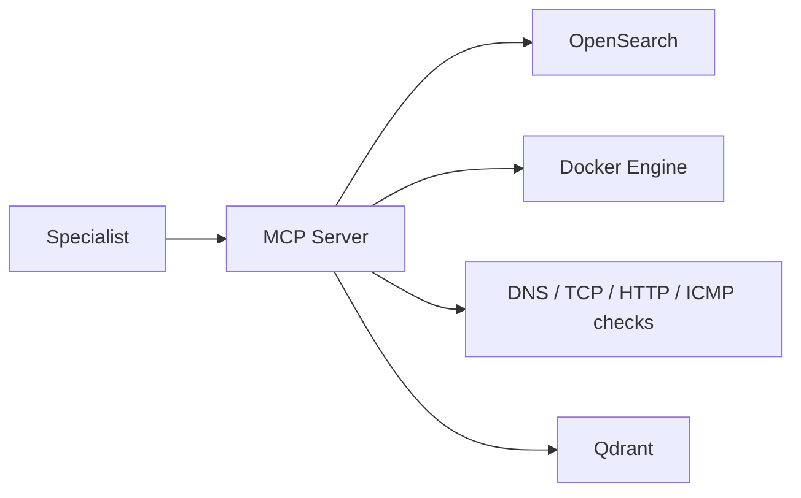
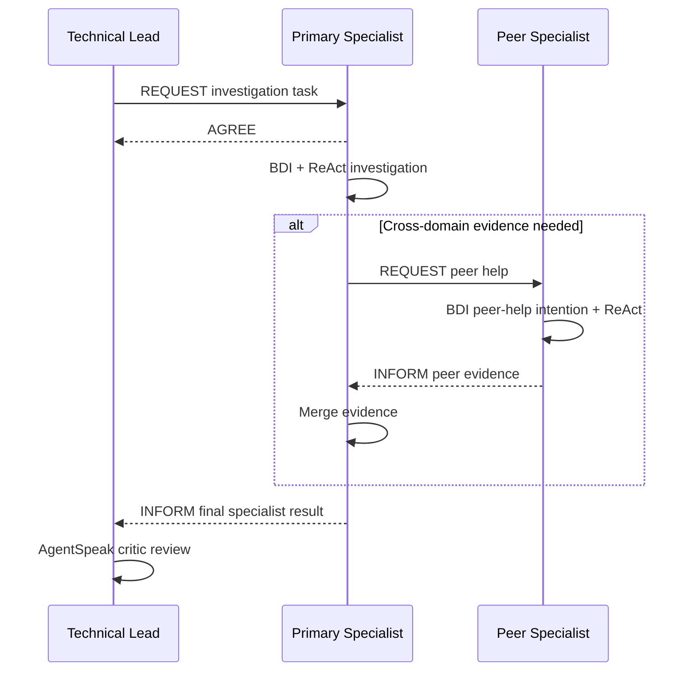

# Design

The current system is designed as a set of loosely coupled runtime areas. The monitored workload, telemetry pipeline, anomaly detection, knowledge base, controlled diagnostic tools, multi-agent reasoning backend, persistence layer, and operator interface are intentionally separated.

## 1. High-level architecture



The infrastructure and monitored workload are different Docker Compose projects. They meet on the shared bridge network `agentic-monitoring-net`. The monitored application also uses a private application network for its internal traffic.

## 2. Monitored system design

The Notes Platform is small enough for controlled experiments but distributed enough to create realistic propagation of faults.



The main request chain is:

```text
traffic-generator -> api-gateway -> processing-service -> data-service
```

`worker-service` is independent and provides a controlled background workload. Requests in the main path carry an `X-Request-ID`, which supports distributed log correlation.

## 3. Observability and anomaly-detection design

Every monitored container runs Telegraf and Fluent Bit. Telemetry is stored by service:

```text
metrics-<service>-YYYY.MM.DD
logs-<service>-YYYY.MM.DD
```

OpenSearch Anomaly Detection operates only on selected metrics. A strict project rule is enforced: **all detectors are SINGLE_ENTITY**.

The current topology is:

```text
CPU
  5 detectors -> one per monitored service

RAM
  5 detectors -> one per monitored service

NETLAT - network transport latency
  traffic-generator  -> api-gateway
  api-gateway        -> processing-service
  processing-service -> data-service

APPLAT - application service latency
  traffic-generator  -> api-gateway
  api-gateway        -> processing-service
  processing-service -> data-service
```

This produces **16 SINGLE_ENTITY detectors**. Network transport latency and application-service latency are intentionally different signals so the diagnostic system can distinguish transport degradation from slow application processing.

Logs are not used by an additional semantic anomaly detector in the current implementation. They are evidence sources for the diagnostic agents.

## 4. Durable anomaly admission

An anomaly does not directly invoke a specialist. OpenSearch results first enter a durable intake path.



The MongoDB anomaly inbox stores normalized observations with states such as `WAITING`, `PROCESSING`, `RECOVERY`, `COMPLETED`, and `DISMISSED`. Admission is durable, deduplicated, and recoverable after a backend restart.

The runtime currently processes one autonomous anomaly workflow at a time. This avoids uncontrolled parallel investigations on a local LLM stack and makes the order of incident processing explicit.

## 5. Incident and task design

MongoDB is the source of truth for agentic state. OpenSearch remains dedicated to telemetry and anomaly detection.

The main persisted concepts are:

- anomaly-inbox records;
- incidents;
- structured incident events;
- durable investigation tasks.

A task has its own state, attempt counter, retry information, outcome, and idempotency key. The incident stores the task reference, while mutable task state remains in the task collection to avoid conflicting copies of the same state.

Raw observability payloads are not copied into the incident database. MongoDB stores the structured conclusions and audit information needed by the operator, while detailed metrics and logs remain in OpenSearch.

## 6. Five-agent architecture

The production team contains exactly five SPADE agents:



The complete graph represents communication capability, not a mandatory execution sequence. The Technical Lead chooses a primary investigator. A specialist may later contact one peer directly if cross-domain evidence is required.

The responsibilities are:

- **Technical Lead:** incident ownership, triage, specialist selection, coordination, and critical review;
- **System Engineer:** Linux, containers, CPU, memory, disk, processes, and runtime state;
- **Network Engineer:** connectivity, transport latency, DNS, sockets, paths, and reachability;
- **Application Engineer:** service health, request flow, dependencies, application latency, and logs;
- **Software Developer:** software behaviour, defects, API semantics, error handling, and code-level explanations.

## 7. AgentSpeak BDI layer

BDI is implemented with real AgentSpeak policies rather than being represented only as Python labels.

The Technical Lead policy contains goals for:

```text
manage_incident
  -> triage_incident
  -> select_primary_investigator

review_investigation_result
  -> commit_review_decision
```

The specialist policy contains goals for:

```text
handle_investigation_task
  -> accept_task
  -> investigate_incident

provide_peer_help
```

Python hosts the AgentSpeak interpreter and exposes narrow bridge actions. Beliefs, goals, and intentions remain explicit AgentSpeak constructs.

## 8. Hybrid specialist ReAct design

Once AgentSpeak commits a specialist investigation intention, the operational diagnostic loop is delegated to the canonical `SpecialistReActExecutor`.



The division of responsibility is deliberate:

- **Gemma** owns causal reasoning, evidence needs, observation interpretation, and diagnostic meaning;
- **Qwen** selects a concrete tool and produces its arguments;
- **MCP/RAG** provides bounded observations;
- **Python** owns deterministic facts and invariants such as detector semantics, schemas, allowed targets, context limits, execution budgets, and traceability.

The runtime does not encode scenario-specific tool sequences. Gemma can change evidence family when the active causal hypothesis justifies it, while validation prevents an accidental drift to an unrelated component or signal.

## 9. Detector-focused incident anchor

Before reasoning begins, the specialist creates a deterministic incident anchor from detector metadata.

The current signal families are:

- `container_cpu`;
- `container_memory`;
- `network_transport_latency`;
- `application_service_latency`.

For path detectors, source and destination are resolved against the components accepted by MCP tool schemas. The agentic backend therefore does not maintain a second hard-coded copy of the monitored topology.

This anchor keeps diagnosis aligned with the signal that actually triggered the incident.

## 10. Controlled MCP tool architecture

The MCP Server is the boundary between reasoning and live system evidence.



The main evidence families are:

- metric history;
- runtime resource state;
- process attribution and process detail;
- log evidence;
- network-path evidence;
- application-endpoint evidence;
- storage state;
- static knowledge.

Every exposed diagnostic operation is bounded and read-only. Targets are allow-listed and a generic shell is not available.

## 11. Dynamic peer collaboration

A specialist can request help only when its completed solo investigation explicitly reports that assistance is required.



Peer collaboration is direct. The Technical Lead does not authorize each peer request. If peer help times out or is unavailable, the primary specialist keeps its solo result rather than losing already collected evidence.

## 12. Model and inference design

Ollama runs natively on Windows and is reached from containers through `host.docker.internal:11434`.

The current Compose defaults are:

```text
reasoning model: gemma4:e4b
tool model:      qwen3.5:4b
embedding model: ibm/granite-embedding:30m
```

A shared inference gate limits concurrent LLM calls. This is important because all agents use the same local Ollama backend and GPU resources.

## 13. Operator dashboard boundary

The dashboard is intentionally not an agent controller.

```text
Autonomous backend -> MongoDB -> read-only FastAPI -> dashboard
```

The operator can inspect incidents, timelines, evidence summaries, tools used, agent activity, remediation, validation, infrastructure health, and generated PDF reports. There are no public HTTP endpoints for manually creating or updating incidents.

The interface displays structured operational rationale but never private model chain-of-thought.

## 14. Human-in-the-loop boundary

The current operational boundary is:

```text
anomaly
  -> autonomous admission and triage
  -> autonomous specialist investigation
  -> optional autonomous peer collaboration
  -> Technical Lead review
  -> diagnosis and remediation recommendation
  -> human operator for disruptive action
```

This keeps the investigation agentic while preserving human control over potentially disruptive remediation.
