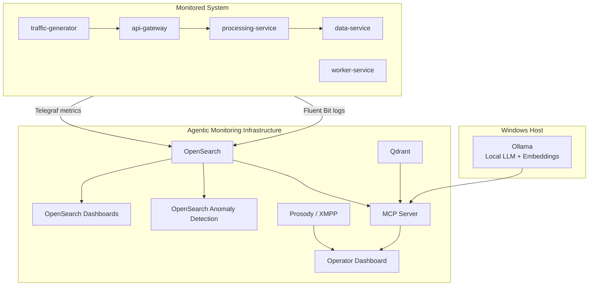
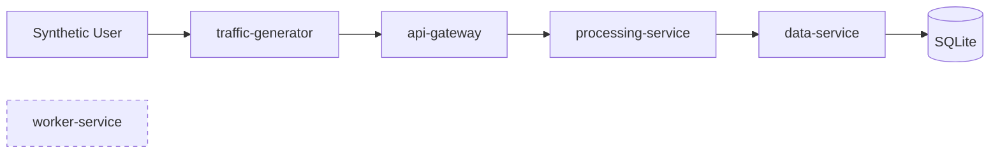
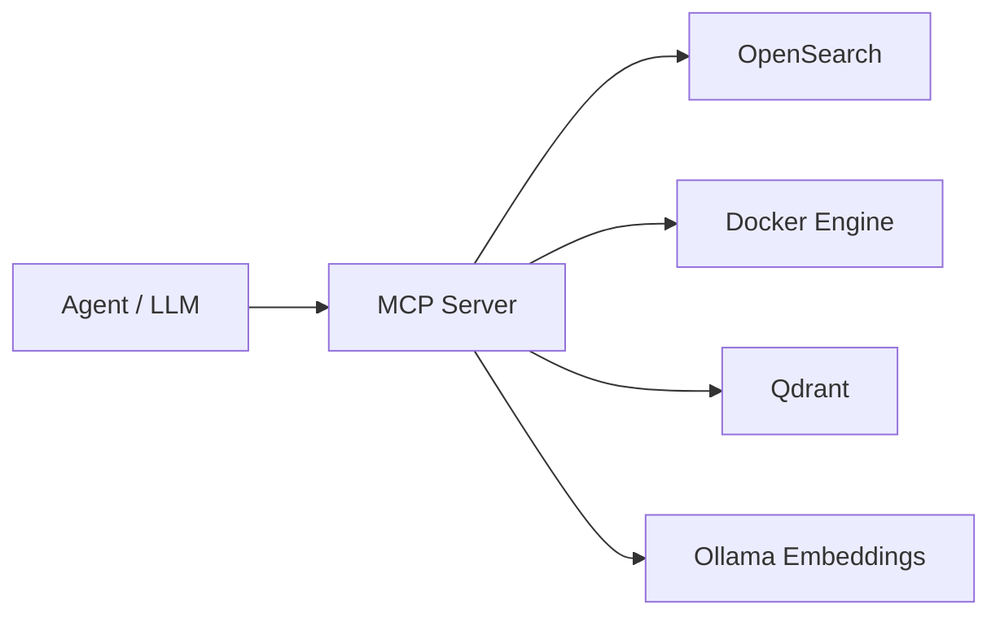
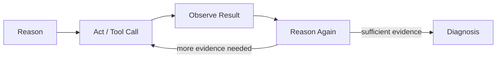
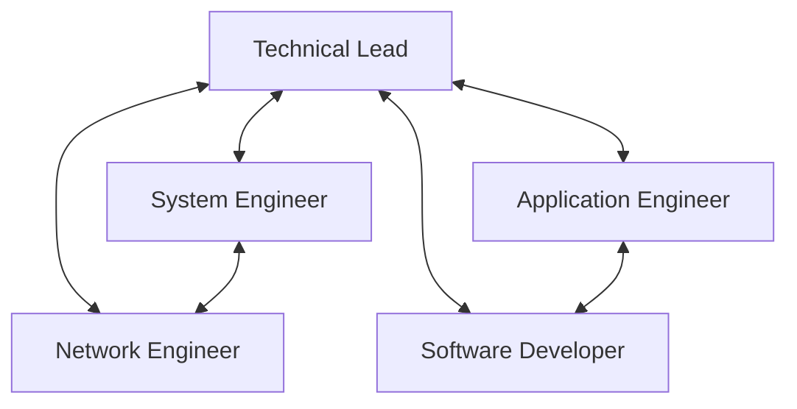

# Design

The system is designed as a set of loosely coupled layers. The monitored workload, telemetry pipeline, diagnostic tools, knowledge base, agent runtime, and operator interface are intentionally separated so that each part can evolve independently.

## 1. High-level architecture



The infrastructure and the monitored workload are two different Docker Compose projects. They communicate through the external bridge network `agentic-monitoring-net`. The monitored application also owns a private network called `monitored-system-net` for internal service communication.

## 2. Monitored system design

The Notes Platform is intentionally small enough to control during experiments but distributed enough to create realistic failure propagation.



The main request chain is:

```text
traffic-generator -> api-gateway -> processing-service -> data-service
```

`worker-service` is independent from the request path and provides a controlled background workload that can be used for memory experiments.

Every generated request includes an `X-Request-ID`. The identifier is propagated through the application services so that distributed log events can be correlated during diagnosis.

## 3. Observability design

Each monitored container runs Telegraf and Fluent Bit.

Telemetry is separated by service:

```text
metrics-<service>-YYYY.MM.DD
logs-<service>-YYYY.MM.DD
```

This design allows each anomaly detector to read one dedicated metric source and simplifies evidence retrieval by the MCP Server.

The current monitored signals include:

- Docker container CPU usage;
- Docker container memory usage;
- interface network counters;
- ICMP RTT;
- end-to-end network-service latency;
- application logs;
- system heartbeat logs.

## 4. Anomaly detection design

OpenSearch Anomaly Detection is used as the online anomaly detection component.

A strict design rule is applied: **all detectors are SINGLE_ENTITY**.

The detector topology is:

```text
CPU
  5 detectors -> one per monitored service

RAM
  5 detectors -> one per monitored service

Network latency
  traffic-generator  -> api-gateway
  api-gateway        -> processing-service
  processing-service -> data-service
```

This gives a total of 13 detectors.

Using separate detectors has two advantages for the thesis prototype:

- the anomaly source is explicit;
- each detector can be analysed independently during controlled experiments.

## 5. Diagnostic tool layer

The MCP Server is the controlled interface between reasoning components and live system evidence.



The MCP layer is deliberately safer than giving an LLM direct shell access. Tools expose predefined diagnostic operations and validate the monitored target before executing Docker inspection commands.

Current tool categories are:

- OpenSearch metric retrieval;
- OpenSearch log retrieval and search;
- Docker process inspection;
- Docker runtime statistics;
- disk and inode inspection;
- network connection inspection;
- knowledge-base semantic search.

The current implementation is read-only.

## 6. Knowledge architecture

The Qdrant knowledge base contains stable technical documentation about the monitored system.

Documents are organised by shared architecture, services, operational domains, and diagnostic patterns. Metadata is designed to support role-aware retrieval using fields such as:

- `roles`;
- `domains`;
- `services`;
- `incident_types`;
- `document_type`;
- `version`.

The five target roles can therefore retrieve different evidence for the same incident without creating separate knowledge silos.

For example, a Network Engineer investigating `api-gateway` should prioritise topology, RTT, network-service latency, and socket information, while a Software Developer should prioritise API behaviour, validation, error propagation, and service-level code symptoms.

## 7. Target hybrid agent architecture

The final reasoning layer is designed as a hybrid **BDI + ReAct** architecture.

BDI is used to model the agent deliberative state:

- **Beliefs:** current facts and evidence about the incident;
- **Desires:** diagnostic goals and desired investigation outcomes;
- **Intentions:** the currently selected course of investigation.

ReAct is used for operational execution:



The important design principle is that BDI and ReAct have different responsibilities. BDI represents what the agent currently believes, wants, and commits to doing. ReAct executes the selected intention through real tool calls and updates the beliefs with observations.

## 8. Virtual technical team

The operator-facing team uses real professional roles:



The graph is not a fixed execution pipeline. The Technical Lead should dynamically involve the specialists required by the current anomaly. Specialists may also exchange evidence when an incident crosses technical domains.

The intended responsibility split is:

- Technical Lead: triage, coordination, hypothesis comparison, critical review;
- System Engineer: Linux, containers, CPU, memory, disk, processes, runtime state;
- Network Engineer: connectivity, latency, paths, sockets, service-to-service network evidence;
- Application Engineer: service health, dependencies, application logs, request flow;
- Software Developer: expected software behaviour, API semantics, error handling, code-level symptoms.

## 9. Operator dashboard design

The Flask dashboard is intentionally outside the autonomous control loop. It observes and presents incident state rather than controlling the internal reasoning of the agents.

It persists:

```text
agentic-incidents-YYYY.MM
agentic-agent-events-YYYY.MM
```

The dashboard shows concise operational rationale and observable actions. It does not store or display private model chain-of-thought.

## 10. Human-in-the-loop boundary

The final decision boundary is designed as:

```text
anomaly
  -> autonomous investigation
  -> evidence collection
  -> diagnosis
  -> remediation recommendation
  -> human operator decision
```

This keeps the system agentic at the investigation level while preserving operator control over potentially disruptive remediation actions.
