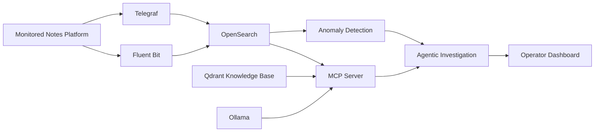

# Introduction

AgenticProactiveMonitor is a thesis prototype for **proactive monitoring and explainable diagnosis of distributed software systems**. The project combines observability, machine-learning-based anomaly detection, retrieval-augmented generation, and a multi-agent architecture designed to support technical incident investigation.

The main objective is not only to detect that a system is behaving abnormally. The system is designed to move from an anomaly signal to an investigation process in which specialised agents can collect evidence, consult technical knowledge, compare possible causes, and produce an explainable diagnosis for a human operator.

## Project idea

The project separates the system under observation from the monitoring and reasoning infrastructure.

The monitored workload is a small distributed **Notes Platform** composed of five containers:

- `traffic-generator`, which simulates real user activity;
- `api-gateway`, which exposes the web interface and routes requests;
- `processing-service`, which implements application processing logic;
- `data-service`, which persists notes in SQLite;
- `worker-service`, which represents an independent background workload.

The monitoring infrastructure is deployed as a separate Docker Compose project and contains OpenSearch, OpenSearch Dashboards, Qdrant, Open WebUI, Prosody/XMPP, the MCP Server, and the operator dashboard. Ollama runs directly on the Windows host and provides local LLM and embedding models.

## Monitoring and diagnosis flow

Metrics and logs are collected continuously. OpenSearch Anomaly Detection is used to identify unusual behaviour in CPU, memory, and network-service latency. Every detector is intentionally configured as **SINGLE_ENTITY**, with a dedicated detector for each monitored source or network link.

When an anomaly is available, the target architecture assigns the investigation to a virtual technical team composed of five professional roles:

- **Technical Lead**;
- **System Engineer**;
- **Network Engineer**;
- **Application Engineer**;
- **Software Developer**.

The specialists are intended to use a BDI-oriented deliberative state together with an operational ReAct loop: reason about the current incident, invoke a controlled diagnostic tool, observe the result, and continue the investigation until enough evidence is available.

## Current implementation status

The repository already contains the main infrastructure required for the thesis experiments:

- a standalone monitored distributed application;
- Telegraf and Fluent Bit telemetry collection;
- OpenSearch indices, dashboards, and anomaly detectors;
- controlled CPU, memory, network, latency, and service-outage scenarios;
- a repeatable PowerShell test suite for detector experiments;
- Qdrant-based knowledge storage and RAG retrieval;
- a Model Context Protocol server exposing read-only diagnostic tools;
- Prosody/XMPP configuration and validated SPADE communication;
- a Flask operator dashboard for incidents, infrastructure health, and agent activity.

The complete production-style multi-agent reasoning backend is the next major implementation step. The dashboard already represents the final five-role team, while the autonomous specialist runtime is still being developed and integrated.

## Human-in-the-loop principle

The project follows a human-in-the-loop approach. The system may autonomously investigate an anomaly and propose a diagnosis or remediation, but the operator remains responsible for approving potentially disruptive corrective actions.

This boundary is important for two reasons. First, the system is a research prototype operating on infrastructure components. Second, explainability and auditability are part of the thesis objective: the operator should be able to understand which evidence supported a diagnosis and why a remediation was suggested.
