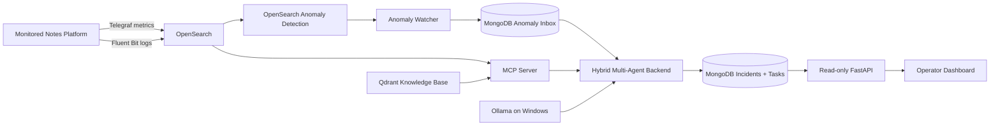

# Introduction

AgenticProactiveMonitor is a thesis prototype for **proactive monitoring and explainable diagnosis of distributed software systems**. The project combines observability, online anomaly detection, retrieval-augmented generation (RAG), and a hybrid multi-agent reasoning architecture.

The objective is not only to detect that a monitored service is behaving abnormally. The complete workflow moves from an anomaly signal to an autonomous investigation in which specialised agents collect live evidence, consult project knowledge, collaborate when needed, and produce a structured diagnosis and remediation proposal for a human operator.

## Project idea

The project separates the application under observation from the monitoring and reasoning infrastructure.

The monitored workload is a distributed **Notes Platform** composed of five containers:

- `traffic-generator`, which simulates real user activity;
- `api-gateway`, which exposes the web interface and routes requests;
- `processing-service`, which implements application processing logic;
- `data-service`, which persists notes in SQLite;
- `worker-service`, which provides an independent background workload.

The agentic infrastructure is a separate Docker Compose project. It contains OpenSearch, OpenSearch Dashboards, Qdrant, MongoDB, Prosody/XMPP, the MCP Server, the agentic backend, the operator dashboard, and the knowledge-base services. Ollama runs directly on the Windows host and provides local language-model and embedding inference.

## End-to-end flow

Metrics and logs are continuously stored in OpenSearch. OpenSearch Anomaly Detection currently monitors four metric families: container CPU, container memory, network transport latency, and application-service latency.

A strict project rule is applied to anomaly detection: **every detector is SINGLE_ENTITY**. The current configuration contains **16 detectors**:

- 5 CPU detectors;
- 5 RAM detectors;
- 3 network transport-latency detectors (`NETLAT`);
- 3 application-service-latency detectors (`APPLAT`).

Logs are not used as a separate semantic anomaly-detection mechanism in the current implementation. They are collected as live diagnostic evidence and can be queried by the agents through MCP.

## Hybrid multi-agent backend

The production backend is implemented as a five-agent virtual technical team:

- **Technical Lead**;
- **System Engineer**;
- **Network Engineer**;
- **Application Engineer**;
- **Software Developer**.

The agents are implemented with SPADE and communicate through Prosody/XMPP. The runtime combines two reasoning levels:

- **AgentSpeak BDI**, which represents explicit goals, beliefs, and committed intentions for coordination and task handling;
- **ReAct**, which is used by specialists to gather and interpret live diagnostic evidence through bounded tool calls.

The Technical Lead takes an incident in charge, performs triage, selects a primary investigator, delegates a durable task, and critically reviews the returned diagnosis. A specialist first commits the delegated task through its BDI policy and then executes a bounded ReAct investigation.

The model roles are intentionally separated. In the current runtime, Gemma performs Technical Lead reasoning and specialist diagnostic reasoning, while Qwen is dedicated to specialist tool selection and argument generation. Python code validates structured evidence requests, tool schemas, target components, execution limits, and trace invariants before a tool is executed.

## Dynamic collaboration

The system does not use a fixed pipeline in which all specialists must run for every incident. The Technical Lead selects the primary specialist according to the anomaly and the current evidence.

If the primary specialist cannot sufficiently confirm a root cause, it can autonomously request help from one peer specialist. This collaboration happens directly over XMPP and does not require a new Technical Lead authorization. The returned peer evidence is combined with the primary investigation and then reviewed by the Technical Lead.

## Evidence and knowledge boundaries

The project separates live evidence from static knowledge:

- **OpenSearch and Docker diagnostics** provide current runtime evidence;
- **Qdrant RAG** provides stable project and domain knowledge;
- **MongoDB** stores durable agentic state, incidents, tasks, anomaly-inbox records, and structured activity history.

RAG supports diagnosis but does not replace live evidence. The knowledge base intentionally excludes scenario ground truth, expected test answers, and evaluation labels.

## Human-in-the-loop principle

The system is autonomous at the investigation level, but potentially disruptive remediation remains under human control. The current MCP diagnostic surface is read-only and does not expose a generic shell.

The operator dashboard is also outside the control loop. It exposes incident state, diagnosis, evidence summaries, remediation guidance, agent activity, tools used, and system health without exposing private model chain-of-thought.
